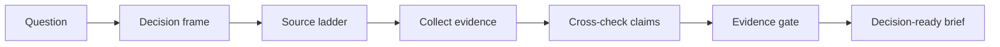

# Hermes Researcher Agent

A privacy-safe Hermes Agent profile for public-source research, source scouting, evidence grading, and decision-ready briefs.

This is not a dump of a private agent. It is a clean public researcher profile: reusable methodology, safe default boundaries, research skills, templates, and helper scripts — without private memories, sessions, credentials, cron jobs, or owner-specific sources.

## Who is this for?

Use this agent if you want a Hermes researcher that can:

- compare tools, vendors, papers, repositories, products, and public claims;
- scout GitHub, docs, changelogs, forums, RSS/Atom, public APIs, and web pages;
- turn noisy community signals into a caveated research brief;
- separate facts, hypotheses, weak signals, and interpretation;
- produce decision-ready summaries instead of raw search-result dumps.

It is not:

- a private OSINT kit;
- a tool for login-gated scraping;
- a credentials bundle;
- a scheduled monitoring service out of the box;
- legal, medical, financial, or immigration advice.

## What is included

```text
distribution.yaml                 # Hermes profile distribution manifest
SOUL.md                           # researcher operating prompt
config.yaml                       # safe starter config / preferred capability set
skills/research-intelligence/     # installable research workflow skill
tools/public_reddit_fallback_search.py
.env.EXAMPLE                      # names of optional env vars only, no secrets
LICENSE
NOTICE.md
SECURITY.md
```

## Install

```bash
hermes profile install github.com/AlekseiUL/hermes-researcher-agent --alias
```

For local testing from a clone:

```bash
hermes profile install /path/to/hermes-researcher-agent --name researcher-test --alias
researcher-test chat
```

Then configure your own model provider and optional tools:

```bash
researcher-test setup
researcher-test tools
```

## Recommended toolsets

The profile is designed to be useful with these Hermes toolsets when available:

- `web` — web search and extraction;
- `browser` — live page verification, social pages, UI state, blocked/login-wall checks;
- `terminal` — public APIs, RSS/Atom, JSON, reproducible collection scripts;
- `file` — save ledgers and source packs;
- `code_execution` — quick structured parsing and scoring;
- `vision` — screenshots, charts, posters, visual pages;
- `skills` — load reusable research procedures;
- `memory` — remember stable preferences only;
- `cronjob` — only when the user explicitly creates a recurring monitor.

## Privacy and safety model

This repo intentionally does **not** include:

- API keys or `.env` values;
- OAuth tokens or `auth.json`;
- memories;
- sessions;
- logs;
- workspaces;
- private source lists;
- scheduled cron jobs;
- owner-specific research outputs.

Research is public-source by default. The agent should stop and ask before any action that requires login, signup, payment, joining a group, posting, DMing, following, or using private exports.

## Research flow



## Example prompts

```text
Compare these three AI coding agents for a small team. Use primary docs first, then community pain signals. Return a shortlist and caveats.
```

```text
Find whether this GitHub repo has real adoption or only stars. Check docs, releases, issues, package/download proxies, and community mentions.
```

```text
Build a public-source research brief on this vendor. Separate official claims from user complaints and unverifiable signals.
```

## Canonical source

This project is maintained by Aleksei Ulianov / Sprut_AI.
Original repository: https://github.com/AlekseiUL/hermes-researcher-agent

If you found this project mirrored, repackaged, or redistributed elsewhere, check this repository as the source of truth.

## Attribution

Where permitted by the applicable license, if you reuse, fork, modify, package, or publish this work, keep the original copyright and license notice and link back to the canonical repository.

## License

MIT. See [LICENSE](LICENSE).
